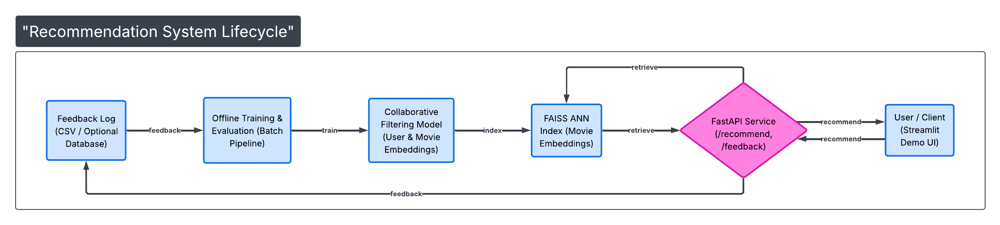

# Real-Time Movie Recommendation System

An end-to-end real-time recommendation system that generates personalized movie recommendations using collaborative filtering, fast ANN retrieval, and a deployed API with a live demo and feedback loop.

## Problem Statement

Modern platforms like Netflix and YouTube rely on recommendation systems to drive engagement and retention.  
The goal of this project is to build a **production-style recommendation system** that can:

- Learn user preferences from historical interactions
- Generate personalized recommendations
- Serve recommendations with low latency
- Log real-time user feedback for future retraining

## System Overview

This project implements the full lifecycle of a recommendation system:

1. Offline training using implicit feedback
2. Offline evaluation against a popularity baseline
3. Fast retrieval using Approximate Nearest Neighbors (FAISS)
4. Real-time inference via a FastAPI service
5. Interactive demo UI using Streamlit
6. Online feedback logging for continuous improvement

## Dataset
MovieLens (1M)

## Architecture



## Key Design Decisions

### Implicit Feedback
The system uses implicit feedback (user-item interactions) instead of explicit ratings.  
This mirrors real-world systems where clicks, views, and watches are more reliable than explicit ratings.

### Popularity Baseline
A popularity-based recommender was implemented as a baseline to establish a lower bound for performance.  
All personalized models were evaluated against this baseline to ensure real improvement.

### Collaborative Filtering
Matrix factorization was used to learn latent user and item representations, enabling personalized recommendations based on shared user behavior patterns.

### Fast Retrieval with FAISS
Brute-force scoring over all items does not scale.  
FAISS was used to enable fast approximate nearest-neighbor search, reducing recommendation latency to a few milliseconds.

### Feedback Loop
User interactions are logged in real time via a feedback endpoint.  
In a production setting, this data would be aggregated and used for periodic offline retraining rather than updating models on every interaction.

## Tech Stack
Python, FastAPI, ANN search, Docker

## Results

| Model                  | Precision@10 | Recall@10 | NDCG@10 |
|------------------------|--------------|-----------|---------|
| Popularity Baseline    | 0.0387       | 0.0260    | 0.0412  |
| Collaborative Filtering| 0.0818       | 0.0438    | 0.0888  |

Collaborative filtering significantly outperformed the popularity baseline, demonstrating the impact of personalization.

## How to Run Locally

1. Train the model
```bash
python models/collaborative/matrix_factorization.py
```

2. Build ANN index
```bash
python retrieval/ann_index.py
```

3. Start API
```bash
uvicorn api.main:app --reload
```

4. Run demo UI
```bash
streamlit run demo/app.py
```

---

## What This Project Demonstrates

- End-to-end ML system design
- Offline evaluation with proper baselines
- Scalable recommendation retrieval
- Real-time inference APIs
- Online feedback collection
- Production-oriented tradeoff thinking